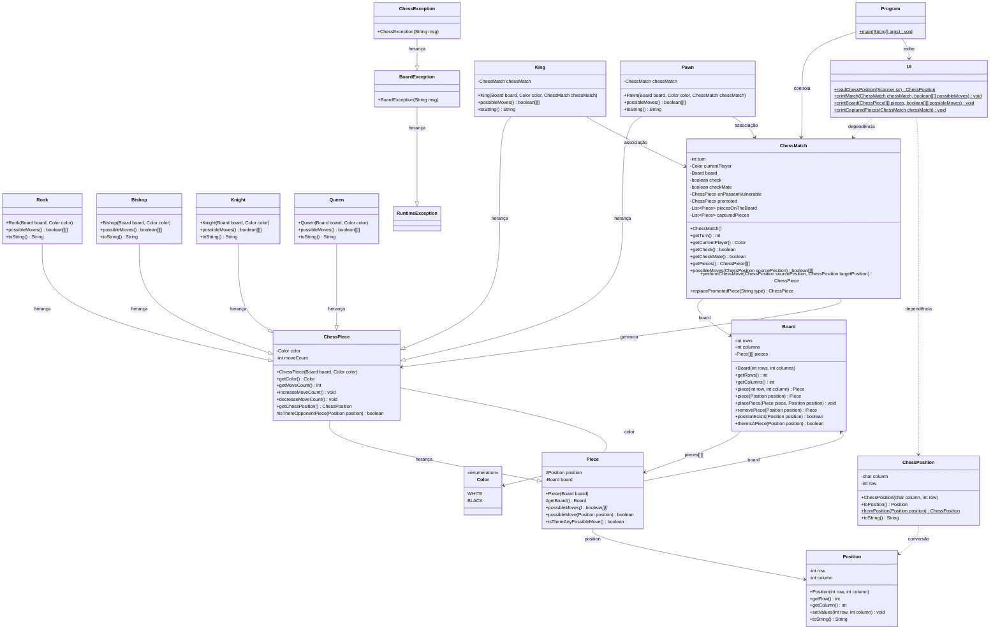

# Relatório Técnico: Sistema de Xadrez em Camadas em Java

Este relatório detalha a arquitetura, as decisões de projeto e a aplicação dos conceitos de Programação Orientada a Objetos (POO) no desenvolvimento do **Sistema de Xadrez em Camadas**. O projeto foi estruturado de forma a isolar as regras complexas de negócios (Xadrez) da infraestrutura de representação de dados (Tabuleiro e Peças).

---

## 1. Arquitetura do Sistema e Divisão em Camadas

O sistema adota uma arquitetura em camadas bem definida, dividindo as responsabilidades em três pacotes principais:

```
src/
├── boardgame/       ← Camada de Tabuleiro (Board Layer) - Estrutura de dados de baixo nível
├── chess/           ← Camada de Xadrez (Chess Layer) - Regras de negócios do jogo
└── application/     ← Camada de Aplicação (Application Layer) - Interface com o usuário
```

### Camada de Tabuleiro (`boardgame`)
Camada genérica de baixo nível que gerencia uma matriz bidimensional de peças. Ela não conhece nenhuma regra de xadrez (não sabe o que é um xeque, um peão ou um roque). Suas responsabilidades limitam-se a:
- Alocar a matriz de tamanho personalizável.
- Posicionar e remover peças em posições específicas.
- Validar se uma posição existe no tabuleiro e se há uma peça nela.

### Camada de Xadrez (`chess`)
Camada especializada que implementa as regras específicas do jogo de xadrez. É aqui que residem:
- A definição das peças e seus movimentos individuais (`Rook`, `Bishop`, `King`, etc.).
- A gestão da partida (`ChessMatch`), turnos, xeque e xeque-mate.
- A conversão de posições do formato de matriz para a notação de xadrez (`ChessPosition`).

### Camada de Aplicação (`application`)
Responsável pela interface do usuário (UI) via console e pelo controle do fluxo do jogo.
- **`UI.java`**: Imprime o tabuleiro, destaca os movimentos possíveis no terminal com cores ANSI e coleta as posições inseridas pelo usuário.
- **`Program.java`**: Contém o método `main`, inicializa a partida e gerencia o loop de turnos e capturas de exceções.

---

## 2. Diagrama de Classes UML

O diagrama abaixo ilustra a arquitetura estrutural das classes, evidenciando as relações de herança, associação e dependência entre os componentes do sistema:



---

## 3. Conceitos de POO Aplicados

### A. Encapsulamento
Evita que o estado interno do jogo seja modificado de maneira inapropriada por outras classes.
- Todos os atributos críticos (como `rows` e `columns` em `Board` e `piecesOnTheBoard` em `ChessMatch`) são definidos como `private`.
- Apenas getters são expostos. Por exemplo, a matriz bidimensional de peças na `ChessMatch` é copiada e exposta apenas como `ChessPiece[][]` via `getPieces()`, impedindo que a aplicação altere diretamente o tabuleiro.
- Uso do modificador `protected` na posição de `Piece`, permitindo que subclasses como `Pawn` ou `King` acessem sua própria posição interna, mas ocultando-a da aplicação externa.

### B. Herança
Permite reuso de lógica comum em estruturas hierárquicas.
- **Hierarquia de Peças**: `Rook`, `Bishop`, `King`, etc. estendem `ChessPiece`, que por sua vez estende a classe abstrata de tabuleiro `Piece`. Com isso, toda a infraestrutura de movimentação genérica reside em `Piece`, a cor e o número de movimentos em `ChessPiece`, e as regras individuais de movimento ficam nas peças concretas.
- **Hierarquia de Exceções**: `ChessException` herda de `BoardException`, a qual por sua vez herda de `RuntimeException`. Isso permite um tratamento centralizado e robusto na aplicação de console através de blocos `try-catch`.

### C. Polimorfismo
Permite que referências genéricas adotem múltiplos comportamentos.
- O método abstrato `possibleMoves()` é definido na classe abstrata `Piece` e implementado de forma distinta em cada peça específica.
- No motor de xeque e xeque-mate em `ChessMatch`, o tabuleiro armazena peças como a superclasse `Piece`. Quando o método `p.possibleMoves()` é chamado para testar ataques ao rei, a JVM executa polimorficamente a versão do método da peça correspondente em tempo de execução (ex: Peão ou Rainha).

### D. Associação e Acoplamento Controlado
- A classe `Piece` possui uma associação direta com `Board` (`private Board board`).
- Para suportar movimentos especiais complexos (como Roque e En Passant) que requerem a verificação do estado geral da partida, as peças `King` e `Pawn` mantêm uma associação com a classe controladora `ChessMatch`.

---

## 4. Lógica de Negócios e Movimentos Especiais Implementados

### Roque (Castling)
O Roque é um movimento duplo envolvendo o Rei e uma das Torres.
1. **Regras**: O Rei e a Torre escolhida não podem ter se movido previamente (`moveCount == 0`), as casas entre eles devem estar livres e o Rei não pode estar em xeque (`!chessMatch.getCheck()`).
2. **Implementação**: O método `King.possibleMoves()` testa a elegibilidade das torres de ambos os lados (ala do Rei - Roque Pequeno; ala da Rainha - Roque Grande). No método `makeMove` em `ChessMatch`, se o Rei mover duas casas horizontalmente, o código move automaticamente a Torre para a casa adjacente oposta, incrementando a contagem de movimentos de ambas as peças.

### En Passant
Captura especial realizada por um Peão sobre outro Peão adversário que avançou duas casas na jogada anterior.
1. **Regras**: Um peão branco na linha 5 (matriz linha 3) ou peão preto na linha 4 (matriz linha 4) pode capturar na diagonal um peão vizinho que acabou de dar o salto duplo inicial.
2. **Implementação**: A classe `ChessMatch` rastreia se algum peão deu um avanço duplo no último lance, armazenando-o no atributo `enPassantVulnerable`. O `Pawn` correspondente verifica se existe um peão elegível adjacente e, em caso positivo, marca a diagonal de ataque correspondente como destino válido. Durante o movimento físico, a peça capturada é removida de sua posição real (que não coincide com a casa de destino final do peão atacante).

### Promoção
Substituição de um Peão que alcançou o extremo oposto do tabuleiro.
1. **Regras**: Qualquer peão que atinja a linha 8 (Brancas, matriz linha 0) ou linha 1 (Pretas, matriz linha 7) deve ser promovido a Rainha, Torre, Bispo ou Cavalo.
2. **Implementação**: Ao final de um lance em `performChessMove`, o sistema detecta se a peça movida foi um peão e se está em uma das fileiras limite. Se sim, define a variável `promoted` e define uma promoção temporária padrão para Rainha (`Q`). No loop da aplicação, o console exibe um prompt solicitando a escolha do usuário e chama `replacePromotedPiece()` para instanciar a peça selecionada.

---

## 5. Como Compilar e Executar o Projeto

### Pré-requisitos
- JDK 11 ou superior instalado e configurado nas variáveis de ambiente (`java`, `javac`).

### Compilação (Windows)
Execute o script em lote na pasta raiz do projeto:
```cmd
compile.bat
```
Este arquivo compila todas as classes no pacote `src` e as coloca na pasta `bin/`.

### Execução (Windows)
Após compilar, execute o script:
```cmd
run.bat
```
Ou manualmente no console através do comando:
```cmd
java -cp bin application.Program
```
